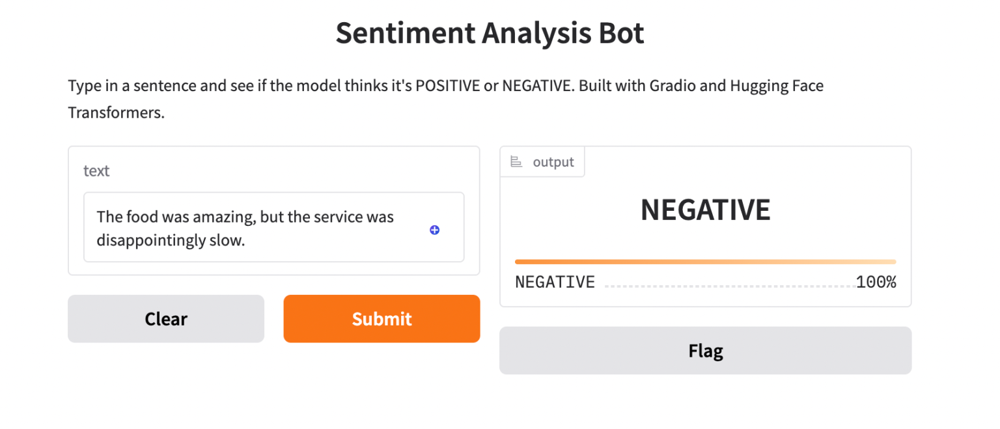

# ML_app — Gradio Sentiment Analysis

Simple Gradio app using Hugging Face Transformers to run a sentiment-analysis pipeline.

## Requirements

- Python 3.9+ (Windows recommended via PowerShell)
- pip

## Quickstart (Windows)

1) Clone or open this folder, then create and activate a virtual environment

```powershell
python --version            # or: py -3 --version
python -m venv .venv        # or: py -3 -m venv .venv
\.venv\Scripts\Activate.ps1
```

If you get an execution policy error in PowerShell, run once:

```powershell
Set-ExecutionPolicy -ExecutionPolicy RemoteSigned -Scope CurrentUser
```

2) Install dependencies

```powershell
pip install --upgrade pip
pip install -r requirements.txt

# If torch fails to resolve automatically on Windows CPU-only, try:
pip install torch --index-url https://download.pytorch.org/whl/cpu
```

3) Run the app

```powershell
python .\app.py
```

Gradio will print a local URL like `http://127.0.0.1:7860`. Open it in your browser.
Running on public URL: https://a1b2c3d4.gradio.app




## Quickstart (Git Bash)

```bash
python -m venv .venv || py -3 -m venv .venv
source .venv/Scripts/activate
pip install --upgrade pip
pip install -r requirements.txt
python app.py
```

## Project Structure

```
ML_app/
├─ app.py              # Gradio interface with Transformers pipeline
├─ requirements.txt    # gradio, transformers, torch
└─ README.md
```

## Notes

- On first run, `transformers` downloads a small sentiment model; wait for it to complete.
- If port 7860 is busy, Gradio will offer another port.
- To deactivate the virtual environment: `deactivate`.

## Troubleshooting

- "torch is not defined" or import errors: ensure `torch` is installed. On Windows CPU-only, use the CPU wheel index shown above.
- PowerShell cannot run the activation script: set execution policy as described in Quickstart.


